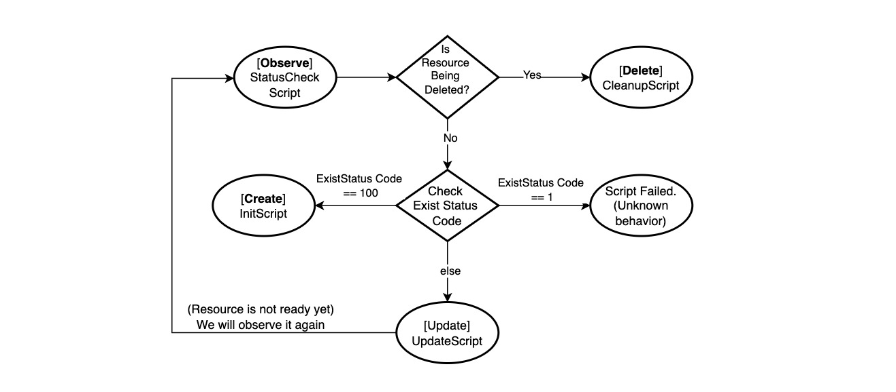

# provider-ssh

## Overview

The `provider-ssh` is a Crossplane provider designed for executing scripts on a remote machine over SSH.

The SSH provider introduces support for `Script` resources. The `Script` resources manages execution 
of a primary script, a status check script, and a cleanup script. The purpose of this provider
is to retrieve data and apply configurations on a remote machine in accordance to the 
managed resources.

The `provider-ssh` requires:

- A `ProviderConfig` type that references a credentials `Secret`, which contains a json file with 
connection details for the remote machine (see an example below).
- A `Script` resource type that includes the `initScript`, `statusCheckScript` and `cleanupScript`.
It also contains a list of `variables` and their corresponding values, which should be replaced 
within the scripts before they are sent to the remote machine.
- A managed resource controller that reconciles `Script` objects, by connecting 
to the target machine, executing the scripts, and writing the output (`stdout` and `stderr`) 
back to the respective status fields of the object.



## Getting Started 

### Installation

You can run the `provider-ssh` locally or install it from an xpkg file. To install the provider use:
```yaml
apiVersion: pkg.crossplane.io/v1
kind: Provider
metadata:
  name: provider-ssh
spec:
  package: docker.io/etesami/provider-ssh:latest
```

### ProviderConfig

To begin, you'll need to create a `ProviderConfig` and a `Secret`. 
To initiate a connection to the remote host, either a `password` or `privateKey` is required. 
The `privateKey` should be provided as a single-line, base64-encoded string. 
To generate the base64 version of a private key, use the following command:

```bash
# In Linux
cat .ssh/id_rsa | base64 -w0
```
The `knownHosts` file is required to verify the identity of the server. 
You can generate and verify it using the command below:

```bash
ssh-keyscan <HOST-REMOTE-IP>
```

Next, construct the `ProviderConfig` and `Secret` as shown below:

```yaml
apiVersion: v1
kind: Secret
metadata:
  namespace: crossplane-system
  name: providerssh-secret
type: Opaque
stringData:
  config: |
    {
      "username": "ubuntu",
      "password": "password",
      "privateKey": "5XUUNPV2tSd0ptTFp...wbTNFKzhqMkYzdXc5ClNRZ09QO",
      "hostIP": "10.29.30.5",
      "hostPort": "22",
      "knownHosts": "10.29.30.5 ecdsa-sha2-nistp256 AAAAE2VjZHN...UpvT57WP45MDBAV4CxQ="
    }
---
apiVersion: ssh.crossplane.io/v1alpha1
kind: ProviderConfig
metadata:
  name: providerssh-config
spec:
  credentials:
    source: Secret
    secretRef:
      namespace: crossplane-system
      name: providerssh-secret
      key: config
```

### Script 

A `Script` object supports the following types of scripts:

- `initScript`: This script is executed the first time and whenever the resource is detected as non-existent.
- `statusCheckScript`: This script is executed frequently to check the status of the resource. 
The exit status code should correspond to the following conditions:
  - `Exit Status Code = 0`: The script executes successfully, and the resource is ready.
  - `Exit Status Code = 1`: The script fails, and the resource is not ready. The `statusCheckScript` 
  will be executed again when the request is requeued.
  - `Exit Status Code = 100`: The resource does not exist on the remote machine. The `initScript` will be executed.
  - `Exit Status Code = Any Other Value`: The resource is not ready yet, and the `statusCheckScript` will 
  be executed again.
- `updateScript`: This script is executed based on the exit status code of the `statusCheckScript`.
- `cleanupScript`: This script is executed when the managed resource is deleted.

The `stdout` and `stderr` fields capture the standard output and standard error, 
respectively, of the last execution of the `statusCheckScript`.

Here is a sample `Script` yaml file:

```yaml
apiVersion: ssh.crossplane.io/v1alpha1
kind: Script
metadata:
  name: sample-script
spec:
  forProvider:
    variables:
      - name: VPN_SERVER_URL
        value: "199.199.199.10"
    initScript: |
      touch /tmp/new_file.txt
      # echo current date and time to the file
      echo {{VPN_SERVER_URL}} >> /tmp/new_file.txt
      date >> /tmp/new_file.txt
      echo "--- --- --- ---" >> /tmp/new_file.txt

      # Create the script file
      cat << 'EOF' > /tmp/prolonged-execution-script.sh
      #!/bin/bash

      HOST_ACCESSIBLE=false
      HOST=google.ca

      while [ "$HOST_ACCESSIBLE" = false ]; do
        ping -c 1 "$HOST" > /dev/null 2>&1
        if [ $? -eq 0 ]; then
          HOST_ACCESSIBLE=true
          echo "INFO: $HOST is accessible. Attempt $RETRY_COUNT"
        else
          echo "INFO: Attempt $(($RETRY_COUNT + 1)): $HOST is not accessible. Retrying..."
          RETRY_COUNT=$((RETRY_COUNT + 1))
          sleep 5
        fi
      done
      EOF

      chmod +x /tmp/prolonged-execution-script.sh

      # Run inside screen to ensure the complete execution of the script
      SESSION_NAME="my-script"
      screen -dmS $SESSION_NAME

      screen -S $SESSION_NAME -X stuff "bash /tmp/prolonged-execution-script.sh^M"
      # The exit status code has no effect.
      # The statusCheck script will determine if the script has executed successfully.
    statusCheckScript: |
      # check if the file exists
      if [ ! -f /tmp/new_file.txt ]; then
        echo "File does not exist"
        exit 105 # Custom exit code.
        # TODO: The exit status code should be made available to updateScript
        # so that appropriate actions can be taken.
      fi
    updateScript: ""
    cleanupScript: |
      rm /tmp/new_file.txt
    sudoEnabled: false
  providerConfigRef:
    name: providerssh-config
```

