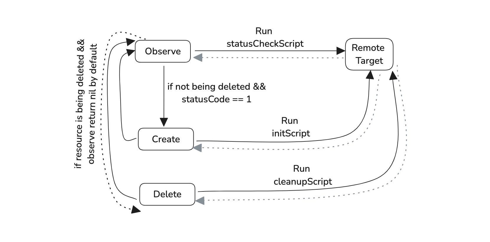

# provider-ssh

## Overview

The `provider-ssh` is a Crossplane provider designed for executing scripts on a remote machine over SSH.

The SSH provider introduces support for `Script` resources. The `Script` resources manages execution 
of a primary script, a status check script, and a cleanup script. The purpose of this provider
is to retrieve data and apply configurations on a remote machine in accordance to the 
managed resources.

The `provider-ssh` requires:

- A `ProviderConfig` type that references a credentials `Secret`, which contains a json file with 
connection details for the remote machine (see an example below).
- A `Script` resource type that includes the `initScript`, `statusCheckScript` and `cleanupScript`.
It also contains a list of `variables` and their corresponding values, which should be replaced 
within the scripts before they are sent to the remote machine.
- A managed resource controller that reconciles `Script` objects, by connecting 
to the target machine, executing the scripts, and writing the output (`stdout` and `stderr`) 
back to the respective status fields of the object.



## Getting Started 

To begin, you'll need to create a `ProviderConfig` and a `Secret`. 
To initiate a connection to the remote host, either a `password` or `privateKey` is required. 
The `privateKey` should be provided as a single-line, base64-encoded string. 
To generate the base64 version of a private key, use the following command:

```bash
# In Linux
cat .ssh/id_rsa | base64 -w0
```
The `knownHosts` file is required to verify the identity of the server. 
You can generate and verify it using the command below:

```bash
ssh-keyscan <HOST-REMOTE-IP>
```

Next, construct the `ProviderConfig` and `Secret` as shown below:

```yaml
apiVersion: v1
kind: Secret
metadata:
  namespace: crossplane-system
  name: providerssh-secret
type: Opaque
stringData:
  config: |
    {
      "username": "ubuntu",
      "password": "password",
      "privateKey": "5XUUNPV2tSd0ptTFp...wbTNFKzhqMkYzdXc5ClNRZ09QO",
      "hostIP": "10.29.30.5",
      "hostPort": "22",
      "knownHosts": "10.29.30.5 ecdsa-sha2-nistp256 AAAAE2VjZHN...UpvT57WP45MDBAV4CxQ="
    }
---
apiVersion: ssh.crossplane.io/v1alpha1
kind: ProviderConfig
metadata:
  name: providerssh-config
spec:
  credentials:
    source: Secret
    secretRef:
      namespace: crossplane-system
      name: providerssh-secret
      key: config
```

### Script 

A `Script` object supports the following:

- `initScript`: This script is executed for the first time and whenever the resource is detected as not existing,
or the `statusCheckScript` returns an error.
- `statusCheckScript`: This script is executed to check the status after running the `initScript`.
- `cleanupScript`: This script is executed when the managed resource is deleted.

When any of these scripts are executed, the `statusCode` field reflects the returned status code of the script execution. 
The `stdout` and `stderr` fields capture the standard output and standard error, 
respectively, of the last execution of the `statusCheckScript`.

Here is a sample `Script` yaml file:

```yaml
apiVersion: ssh.crossplane.io/v1alpha1
kind: Script
metadata:
  name: sample-script
spec:
  forProvider:
    variables:
      - name: VPN_SERVER_URL
        value: "199.199.199.10"
    initScript: |
      touch /tmp/new_file.txt
      # echo current date and time to the file
      echo {{VPN_SERVER_URL}} >> /tmp/new_file.txt
      date >> /tmp/new_file.txt
      echo "--- --- --- ---" >> /tmp/new_file.txt
      cat /tmp/new_file.txt
    statusCheckScript: |
      # check if the file exists
      if [ -f /tmp/new_file.txt ]; then
        echo "File exists"
        # check if the file has the correct content
        if grep -q {{VPN_SERVER_URL}} /tmp/new_file.txt; then
          echo "File has the correct content"
          exit 0
        else
          echo "File does not have the correct content"
          exit 1
        fi
      else
        echo "File does not exist"
        exit 1
      fi
    cleanupScript: |
      rm /tmp/new_file.txt
    sudoEnabled: false
  providerConfigRef:
    name: providerssh-config
```

